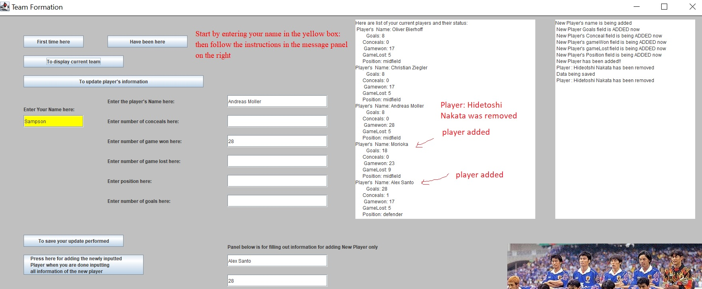
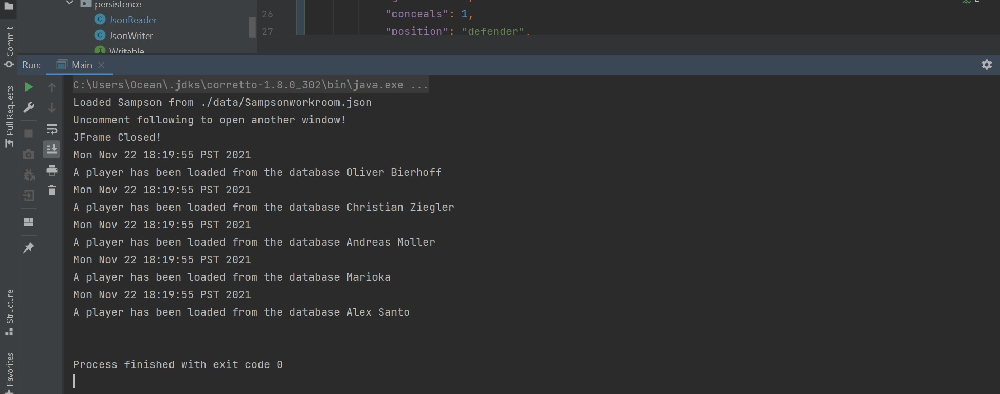

# TTFA-Trustable Team Formation Advisor

## Scientific Management of Soccer Team

*What will the application do?*
- Store available players to choose from
- Display some player statistics
- Suggest a formation 

*Who will use it?*
- Coach
- Team manager
 
*Why is this project of interest to you?*
- I think this project could actually be applied in other
circumstances as well not just in soccer. For
example this could be modified to be used
as an application that manages stock porfolios
- I have always like soccer, so I want to input 
some of my favorite players and set a team

## User Stories
- Add a player to the list of available to choose from
- Remove a player if not considered available anymore
- Display some statistics of player: such as goals scored,
  goals concealed, game won, game lost, position
- Edit a player's goals scored, goals concealed, game won,
  game lost, position status
- I want to be able to retrieve the players that
  have entered to the database from last time and do
  modifications to them if needed
- I want to be able to save the players that I have
  input to the database this time

## Phase 4: Task 2
Some of the events relating X's and Y such as adding X to Y, removing X from Y were actually
implemented in my ui packages. I was able to capture those events using
EventLog, and can print all the events.
Image 1: players added, removed,
editted

Image 2: the operations in Image1 being captured by EventLog
as shown in this image

However since making calls to logEvent is not
allowed in the ui package, so only the loading of the data is captured after
I comment out those lines that capture the logEvent in the ui package as shown
in Image 3 below.
Image 3: the operations in Image1 after commenting
out the EventLog operations in the ui packages

