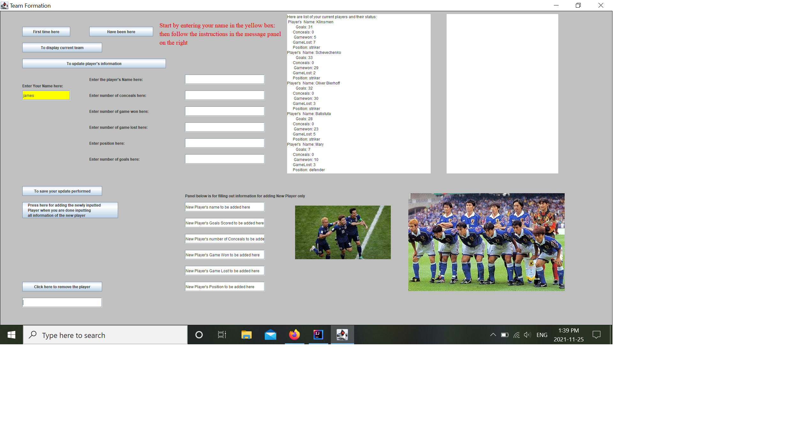
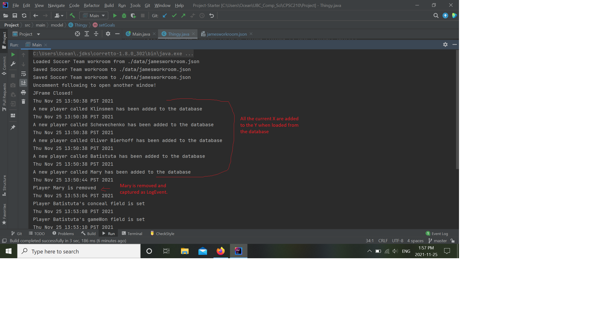
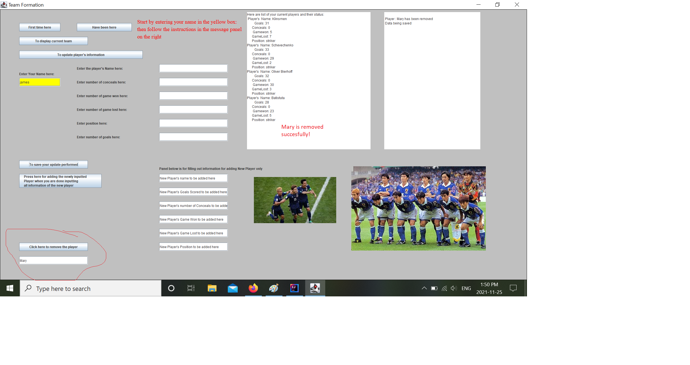
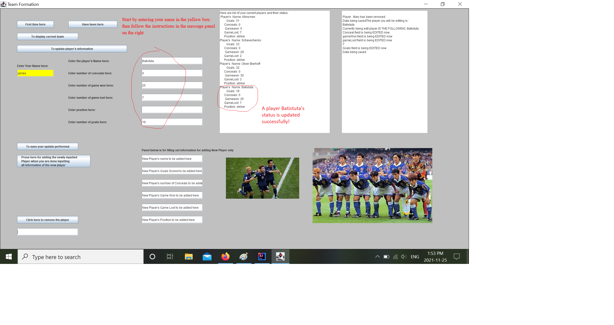
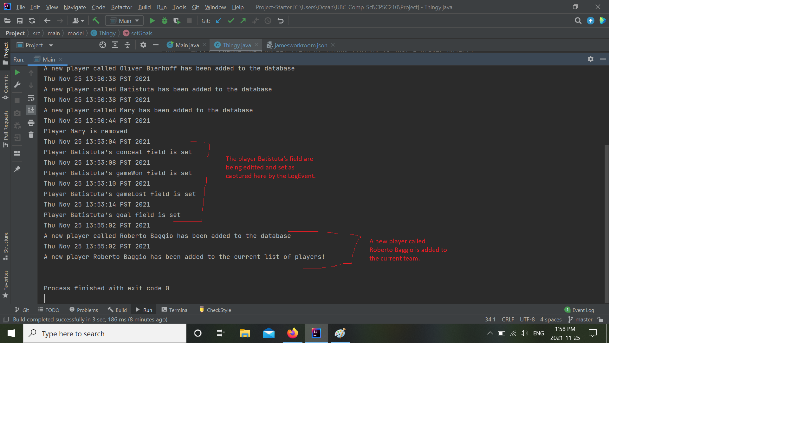
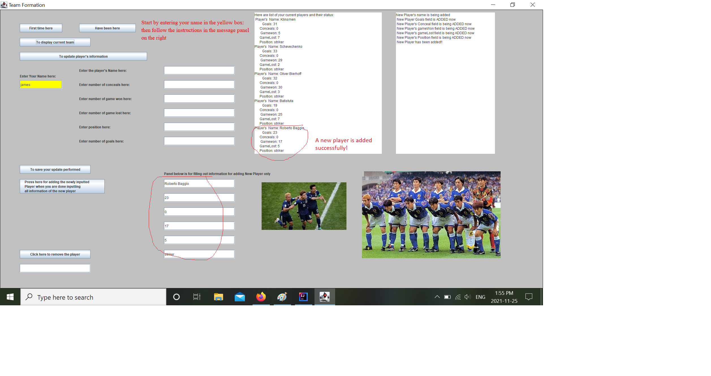

# TTFA-Trustable Team Formation Advisor

## Scientific Management of Soccer Team

*What will the application do?*
- Store available players to choose from
- Display some player statistics
- Suggest a formation 

*Who will use it?*
- Coach
- Team manager
 
*Why is this project of interest to you?*
- I think this project could actually be applied in other
circumstances as well not just in soccer. For
example this could be modified to be used
as an application that manages stock porfolios
- I have always like soccer, so I want to input 
some of my favorite players and set a team

## User Stories
- Add a player to the list of available to choose from
- Remove a player if not considered available anymore
- Display some statistics of player: such as goals scored,
  goals concealed, game won, game lost, position
- Edit a player's goals scored, goals concealed, game won,
  game lost, position status
- I want to be able to retrieve the players that
  have entered to the database from last time and do
  modifications to them if needed
- I want to be able to save the players that I have
  input to the database this time

## Phase 4: Task 2
All the current players are loaded to the WorkRoom when data are being retrieved
as shown in Image 1 and also captured by the LogEvent as shown in picture LogEvent1.

Image 1: players loaded from the database

LogEvent1

A player is removed succesfully and captured by the LogEvent as shown in Image 2 and 
picture LogEvent1.

Image 2: A player is removed.

A player's status (i.e. fields) are editted and set succesfully and captured
by the Image 3 and LogEvent as shown in the picture LogEvent2.
Image 3: Player's field has been editted. 
LogEvent2

A new player called Roberto Baggio is added succesfully as shown in Image 4. It
is also captured by the LogEvent as shown in the image LogEvent2.

Image 4: A Player has been added. 
LogEvent2
